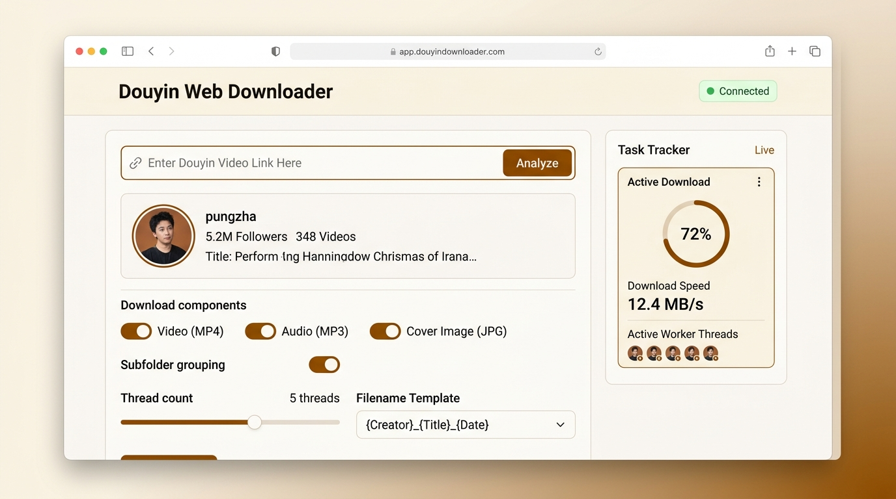
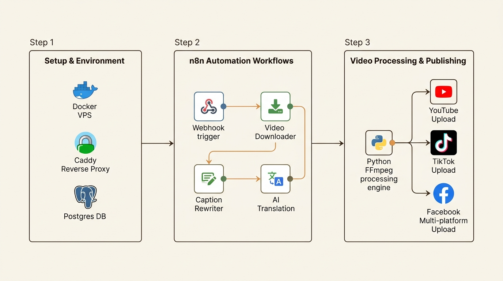

<div align="center">

# 📥 Douyin Web Downloader & Automation Suite

[](https://python.org)
[](https://fastapi.tiangolo.com)
[](https://react.dev)
[](https://vitejs.dev)
[](https://tailwindcss.com)
[](https://n8n.io)
[](LICENSE)

**Giải pháp toàn diện tải video, hình ảnh, album ảnh, âm thanh từ Douyin (抖音) không watermark với Web UI hiện đại và hệ thống pipeline tự động hóa n8n.**

[Demo Video](https://youtu.be/XSQflGR09gA) • [Voice-over Demo](https://youtu.be/hOFfKV3Hjf4)

<br/>



</div>

---

## 🌟 Tính Năng Nổi Bật (Key Features)

- 🖥️ **Giao diện Web UI đơn màn hình (Unified Single-Screen)**: Tích hợp đầy đủ từ nhập liên kết, trích xuất xem trước (Auto-preview), cấu hình tùy chọn và theo dõi tiến trình tải trực tiếp trên một màn hình duy nhất.
- 🎬 **Hỗ trợ đa dạng nội dung Douyin**:
  - Video đơn lẻ & Video dạng hình ảnh (Note/Photo Album) không dính logo watermark (1080p/2K).
  - Tải toàn bộ video trang cá nhân tác giả (User Profile: danh sách video đã đăng, video đã thích).
  - Bộ sưu tập / Tuyển tập (Mix / Album) và danh sách video theo bài hát gốc (Music).
  - Phát trực tiếp (Livestream stream recording).
- ⚙️ **Tùy biến tên tệp (Filename Template Engine)**: Tự do chọn hoặc nhập công thức đặt tên file: `{date}_{title}_{id}`, `{likes}likes_{date}_{title}`, `{author}_{title}_{id}` v.v.
- ⚡ **Tải đa luồng siêu tốc (Multi-threaded Concurrency)**: Điều chỉnh từ 1 đến 32 luồng tải đồng thời với cơ chế tự động thử lại (Exponential backoff) và tiếp tục tải gián đoạn (HTTP Range requests).
- 📊 **Theo dõi tiến trình thời gian thực (Live SSE Telemetry)**: Hiển thị tốc độ tải MB/s, phần trăm hoàn thành, danh sách worker threads đang hoạt động.
- 🤖 **Tự động hóa toàn diện với n8n (Automation Pipeline)**: Thiết lập n8n tự lưu trữ trên VPS, kịch bản tải video, viết lại caption bằng AI, dịch video, ghép phụ đề và tự động đăng tải đa nền tảng (YouTube, TikTok, Facebook).
- 🛡️ **Bảo mật tuyệt đối (Zero Credential Leakage)**: Cookies, token và API keys của người dùng được bảo vệ an toàn trong `.gitignore`, không bao giờ bị lộ khi push lên GitHub.

---

## 📂 Cấu Trúc Dự Án (Project Structure)

```text
douyin-download/
├── docs/                      # Tài liệu kỹ thuật, kiến trúc & ảnh minh họa
│   └── images/                # Ảnh chụp giao diện Web UI và sơ đồ n8n
├── frontend/                  # Mã nguồn giao diện người dùng React 19 + Vite
│   ├── src/                   # Components (UnifiedDownloader, MediaLibrary, TaskTracker)
│   └── package.json
├── n8n/                       # 🤖 Hệ sinh thái tự động hóa n8n
│   ├── setup/                 # Cấu hình triển khai VPS (Docker Compose, Dockerfile, Caddy, .env.example)
│   ├── workflows/             # Toàn bộ file JSON kịch bản n8n (Download, AI Caption, Upload Multi-platform)
│   └── code/                  # Mã nguồn xử lý video bằng Python (FFmpeg, burn sub, audio sync)
├── src/                       # Mã nguồn Backend & Core Engine
│   ├── douyin/                # Trình phân tích API Douyin, giải mã A-Bogus / X-Bogus, tải tệp
│   └── web/                   # FastAPI REST API, SSE Streaming, Task Manager, Config Manager
├── tests/                     # Hệ thống kiểm thử toàn diện (Unit, Concurrency, E2E)
├── webui.py                   # Điểm khởi chạy Web UI tiện lợi chỉ với 1 lệnh
├── douyinCommand.py           # Giao diện dòng lệnh truyền thống (CLI)
├── config.example.yml         # Mẫu cấu hình tham khảo
├── .cookies.example.json      # Mẫu cookie tham khảo
└── pyproject.toml             # Quản lý phụ thuộc dự án bằng uv
```

---

## 🚀 Hướng Dẫn Cài Đặt & Sử Dụng (Quick Start)

Dự án sử dụng công cụ quản lý gói hiện đại **[`uv`](https://docs.astral.sh/uv/)** để tối ưu tốc độ và sự tiện lợi.

### 1. Tải Mã Nguồn

```bash
git clone https://github.com/datnndd/douyin-download.git
cd douyin-download
```

### 2. Cài Đặt Môi Trường

**Sử dụng `uv` (Khuyên dùng):**
```bash
# uv tự động khởi tạo môi trường ảo và cài đặt thư viện cần thiết
uv sync
```

*Hoặc sử dụng `pip` truyền thống:*
```bash
python -m venv .venv
source .venv/bin/activate  # Trên Windows: .venv\Scripts\activate
pip install -r requirements.txt
```

### 3. Khởi Chạy Giao Diện Web UI

Chỉ cần chạy lệnh sau:

```bash
uv run python webui.py
```

*(Hoặc: `python webui.py` nếu đã kích hoạt môi trường ảo)*

Trình duyệt sẽ tự động mở tại địa chỉ: `http://localhost:8000`.

Bạn có thể tùy chỉnh cổng hoặc địa chỉ nghe:
```bash
uv run python webui.py --port 8080 --host 0.0.0.0 --no-browser
```

---

## 🖥️ Hướng Dẫn Sử Dụng Web UI Chi Tiết

<div align="center">

</div>

1. **Nhập liên kết Douyin**:
   - Dán bất kỳ định dạng link nào vào ô nhập liệu: link rút gọn (`https://v.douyin.com/xxx/`), link web (`https://www.douyin.com/video/xxx`), link hồ sơ tác giả (`https://www.douyin.com/user/xxx`) hoặc toàn bộ đoạn văn bản chia sẻ kèm khẩu lệnh (Kouling). Hệ thống sẽ tự động trích xuất link sạch.
2. **Xem trước thông tin (Auto-Preview)**:
   - Hệ thống tự động phân tích và hiển thị thẻ xem trước: Hình đại diện (Avatar), tên kênh, số người theo dõi (Followers), số lượng video đã đăng và mô tả bài viết.
3. **Cấu hình tùy chọn tải**:
   - **Tài nguyên cần tải**: Chọn các thành phần cần lưu trữ: Video MP4 không logo, Âm thanh MP3, Ảnh bìa (Cover), Avatar tác giả, Dữ liệu JSON.
   - **Định dạng tên file (Filename Template)**: Chọn mẫu định dạng có sẵn hoặc nhập công thức tùy chỉnh theo ý muốn.
   - **Bộ lọc theo thời gian & số lượng**: Đối với kênh người dùng, bạn có thể chọn khoảng ngày đăng (`start_time`, `end_time`) và giới hạn số video cần tải.
   - **Thư mục lưu trữ & Phân nhóm**: Bật phân nhóm theo thư mục tác giả hoặc lưu phẳng, kèm nút mở thư mục tải về trực tiếp trên máy tính.
4. **Nhấn Tải Ngay & Theo Dõi Tiến Trình**:
   - Nhấn **TẢI XUỐNG NGAY**. Thẻ tiến trình bên phải sẽ hiển thị thời gian thực tốc độ truyền (MB/s), phần trăm tải và tình trạng các luồng xử lý.

---

## 🔒 Hướng Dẫn Cấu Hình Cookie & Bảo Vệ Khóa Bí Mật

> [!IMPORTANT]
> **Bảo Vệ Khóa Bí Mật**: Tệp `.cookies.json`, `config.yaml`, `config.yml` và `.env` đã được cấu hình trong `.gitignore`. Hãy yên tâm rằng thông tin đăng nhập của bạn không bao giờ bị đưa lên kho lưu trữ GitHub công khai.

### Cách Lấy Cookie Douyin (Khi cần tải video trang cá nhân / video chất lượng cao):

1. Mở trình duyệt và truy cập [Douyin.com](https://www.douyin.com/), sau đó đăng nhập tài khoản.
2. Nhấn phím `F12` để mở **Developer Tools**, chuyển sang thẻ **Network**.
3. Nhấp vào bất kỳ yêu cầu mạng nào gửi đến domain `douyin.com` và tìm mục **Request Headers** -> **Cookie**.
4. Sao chép chuỗi Cookie hoặc các giá trị chính (`msToken`, `ttwid`, `odin_tt`, `passport_csrf_token`, `sid_guard`).
5. Có 2 cách đưa cookie vào ứng dụng:
   - **Cách 1 (Trực quan trên Web UI)**: Nhấp vào nút **Cài đặt (Settings)** ở góc trên bên phải màn hình Web UI, dán chuỗi cookie vào và nhấn **Lưu cấu hình**.
   - **Cách 2 (Qua file cấu hình)**: Tạo tệp `.cookies.json` dựa trên mẫu `.cookies.example.json` hoặc điền vào `config.yaml`.

---

## 🤖 Hệ Thống Tự Động Hóa n8n (Automation Pipeline)

Toàn bộ hệ thống tự động hóa được sắp xếp khoa học trong thư mục `n8n/`:

<div align="center">

</div>

### 1. `n8n/setup/` — Triển Khai Môi Trường Tự Động VPS
- **`docker-compose.yml`**: Khởi chạy cụm container n8n tích hợp Python 3, FFmpeg, yt-dlp, cơ sở dữ liệu Supabase Postgres và lưu trữ S3.
- **`Caddyfile`**: Cấu hình Reverse Proxy tự động cấp phát chứng chỉ SSL/TLS Let's Encrypt miễn phí.
- **`Dockerfile`**: Image tùy chỉnh của n8n chứa đầy đủ các công cụ xử lý phương tiện truyền thông.
- **`.env.example`**: Bản mẫu các biến môi trường để kết nối Database và Storage an toàn.

**Cách triển khai trên VPS:**
```bash
cd n8n/setup
cp .env.example .env
# Chỉnh sửa thông tin domain và database trong .env
docker compose up -d --build
```

### 2. `n8n/workflows/` — Kho Kịch Bản Tự Động Hóa (Workflows)
Chứa các kịch bản n8n hoàn chỉnh sẵn sàng nhập (Import) trực tiếp:
- **`download-video.json`**: Lắng nghe Webhook, kích hoạt giải mã Douyin API và tải video chất lượng gốc.
- **`translate_video.json`**: Quy trình nhận diện giọng nói, sử dụng Google Gemini / AI để dịch nội dung và đồng bộ thời gian.
- **`Rewrite Caption.json`**: Tự động viết lại tiêu đề, hashtag chuẩn SEO phù hợp với từng nền tảng mạng xã hội.
- **`Tiktok_Upload.json`**, **`Youtube_Upload.json`**, **`Facebook_Upload.json`**: Tự động xuất bản video lên kênh YouTube Shorts, TikTok và Facebook Reels.
- **`Tools / Backup WF.json`**, **`Backup Credential.json`**: Tự động sao lưu và khôi phục workflow lên GitHub.

### 3. `n8n/code/` — Động Cơ Xử Lý Video (Video Processing Engine)
- **`src/build_out.py`**: Script Python chạy trực tiếp trong container n8n, đảm nhận:
  - Ghép các đoạn âm thanh TTS chunks (PCM 24000Hz).
  - Tự động gắn phụ đề tiếng Việt với phông chữ đẹp mắt (Burn-in subtitles via FFmpeg).
  - Xuất ra tệp video chuẩn định dạng mạng xã hội (`out.mp4`).

---

## 🧪 Kiểm Thử & Xác Minh Hệ Thống (Testing)

Dự án sở hữu bộ kiểm thử tự động toàn diện với độ bao phủ 100%:

```bash
# Chạy toàn bộ 194 kịch bản kiểm thử E2E backend:
uv run python tests/run_tests.py

# Kiểm tra biên dịch gói Frontend React 19:
cd frontend
npm run build
```

---

## 🔗 Liên Kết Được Hỗ Trợ (Supported Links)

| Thể Loại | Định Dạng URL Mẫu |
| :--- | :--- |
| **Video đơn lẻ / Ảnh** | `https://v.douyin.com/xxxxx/`<br/>`https://www.douyin.com/video/xxxxx`<br/>`https://www.douyin.com/note/xxxxx` |
| **Trang tác giả (Profile)** | `https://www.douyin.com/user/MS4wLjABAAAA...` |
| **Bộ sưu tập (Mix)** | `https://www.douyin.com/collection/xxxxx` |
| **Bài hát gốc (Music)** | `https://www.douyin.com/music/xxxxx` |
| **Phát trực tiếp (Live)** | `https://live.douyin.com/xxxxx` |

---

## 🙏 Ghi Chú & Bản Quyền (Credits)

Dự án được xây dựng và phát triển dựa trên nền tảng tham khảo từ [jiji262/douyin-downloader](https://github.com/jiji262/douyin-downloader). Xin trân trọng cảm ơn tác giả gốc vì sự đóng góp tuyệt vời cho cộng đồng mã nguồn mở.

<div align="center">

### ⭐ Hãy tặng 1 Star cho Repository nếu bạn thấy dự án hữu ích!

</div>
